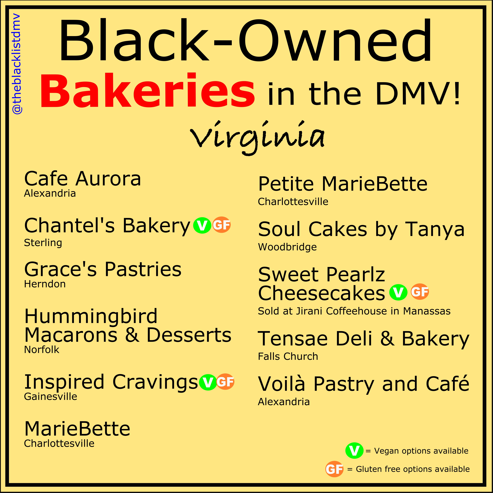

## [Cafe Aurora](http://cafeaurorausa.com/)

Alexandria, VA

## [Chantel's Bakery](https://chantelsbakery.com/)

Sterling, VA

Vegan, Gluten-Free options available

## [Grace's Pastries](https://www.thegracespastries.com/)

Herndon, VA

## [Humming Bird Macarons & Desserts](http://www.hummingbirdmacarons.com/)

Norfolk, VA

## [Inspired Cravings](https://inspiredcravings.com/)

Gainsville, VA

Vegan, Gluten-Free options available

## [MarieBette](http://www.mariebette.com/)

Charlottesville, VA

## [Petite MarieBette](http://www.mariebette.com/)

Charlottesville, VA

## [Soul Cakes by Tanya](http://www.soulcakesbytanya.com/)

Woodbridge, VA

## [Sweet Pearlz Cheesecakes](https://www.sweetpearlzcheesecakes.com/menu)

Sold at Jirani Coffeehouse in Manassas, VA

Vegan, Gluten-Free options available

## [Tensae Deli & Bakery](https://www.tensaebakery.com/)

Falls Church, VA

## [Viola Patry and Cafe](http://www.voilapastryandcafe.com/)

Alexandria, VA
