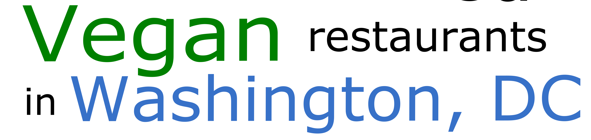

1. [Elife Life Vegan Restaurant](https://theblacklistdmv.com/Elife%20Life%20Vegan%20Restaurant)

   - Cedar St.
   - Good Hope Rd.

2. [Khepra's Raw Food Juice Bar](http://kheprasrawfoodjuicebar.com/)

   - 10th St.

3. [NuVegan](https://www.ilovenuvegan.com/)

   - 6th St.
   - Georgia Ave.

4. [Senbeb Cafe](http://www.senbebcafe.com/)

   - 3rd St.

5. [Sweet Sosumba Jamaican Vegan Cafe](https://sweetsosumba.com/)

   - Georgia Ave.

6. [Turning Natural](https://www.turningnatural.com/)

   - 4th St.
   - 9th St.
   - H St.
   - MLK Jr. Ave.

7. [Dodah's Kitchen](https://dodahskitchen.com/)

   - Catering, Wholesale
   - Mount Rainier, MD

8. [Good Green Grubbery](https://www.instagram.com/goodgreengrubbery/)

   - Catering

9. [Sunflower Gardenz](https://www.facebook.com/SunflowerGardenz/)

   - Contact to order

10. [VegHeaven](https://www.vegheavendc.com/)
    - Online and farmers Markets
