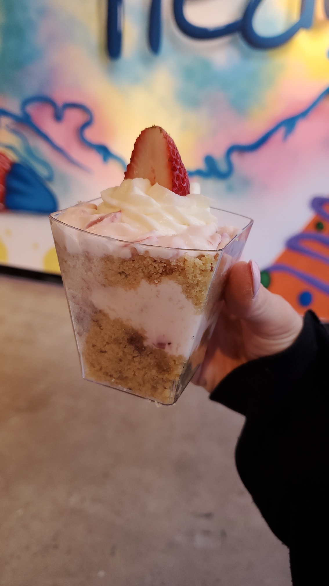
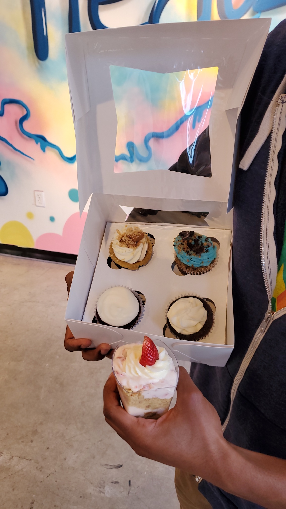
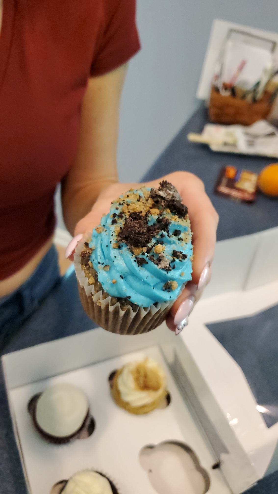
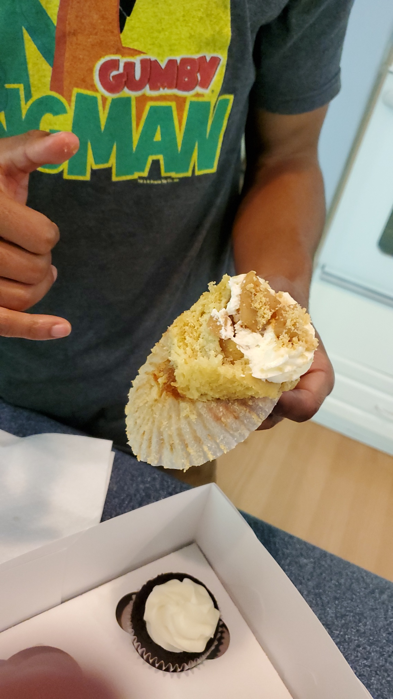

🧁 It’s time to get messy!! We had the chance to visit Messy Treatz in the National Harbor this weekend! @messytreatz 🧁

😍 We LOVED the cupcakes! The cake was super moist and crumbly. The icing EVERYTHING - super soft and fluffy, similar to whipped cream! The whole thing melted in your mouth! 😍

🍪 Liz loved the Cookie Monster, with cookie bits baked into the cake!

🍎 Shi got the Apple Cobbler cupcake, with slices of apples coated in cinnamon & sugar on the top AND in the middle. The apples were sweet, but they didn’t overpower the cake flavor. Perfection in a cupcake!

💙 We got to meet the owner Brittany and her daughters, who were so nice and friendly! It’s great to have a Black-owned, woman-owned, and family-run business here at the @nationalharbor! 💙

🧁 Messy Treatz

📍 185 Waterfront St, Oxon Hill, MD 20745

📸 Instagram: [@messytreatz](https://www.instagram.com/messytreatz/)

🐦 Twitter: [@messytreatz](https://www.instagram.com/messytreatz/)

🎶 TikTok: [@messytreatz](https://www.instagram.com/messytreatz/)

💻 Website: [https://messytreatz.store](https://messytreatz.store)

➡️ Facebook: Messy Treatz [https://facebook.com/MessyTreatz](https://facebook.com/MessyTreatz)

❗️ Yelp: MESSY TREATZ [https://yelp.com/biz/messy-treatz-oxon-hill](https://yelp.com/biz/messy-treatz-oxon-hill)

