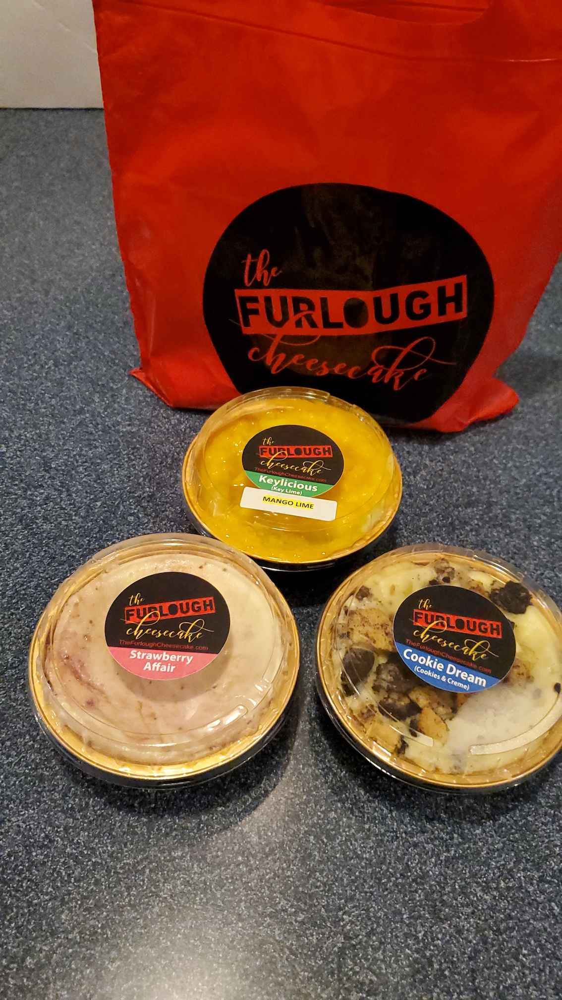
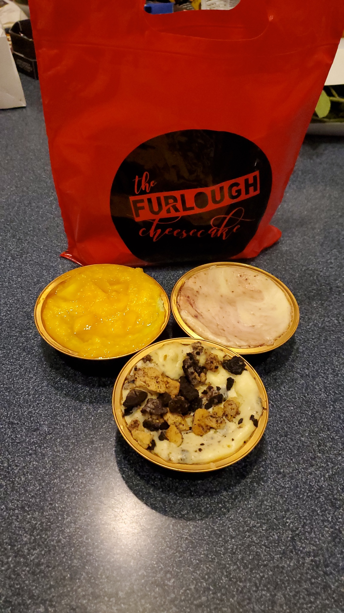

When these sisters lost their jobs in the government shutdown, they made something sweet out of a sour situation.

🍰 The Furlough Cheesecake [@thefurloughcake](https://www.instagram.com/thefurloughcake/) was created by sisters Nikki and Jaqi in January 2019, during the infamous federal government shutdown. They have seen a whirlwind of success since then, including features on [@cnn](https://www.instagram.com/cnn/), [@theellenshow](https://www.instagram.com/theellenshow/), and [@owntv](https://www.instagram.com/owntv/)!

❤️ The owners Nikki and Jaqi have an incredible story, and they are very kind people as well. Not to mention they make some BOMB cheesecakes!

☕️ They also have a Latte Bar in-store, ran by Nikki’s daughter Dani!

🌱 Vegan and gluten-free options available!

The Furlough Cheesecake

📍 170 American Way, Oxon Hill, MD

📸 Instagram: [@thefurloughcake](https://www.instagram.com/thefurloughcake/)

🐦 Twitter: [@thefurloughcake](https://www.instagram.com/thefurloughcake/)

➡️ Facebook: The Furlough Cheesecake [facebook.com/thefurloughcake](https://facebook.com/thefurloughcake)

🎥 YouTube: The Furlough Cheesecake Sisters

